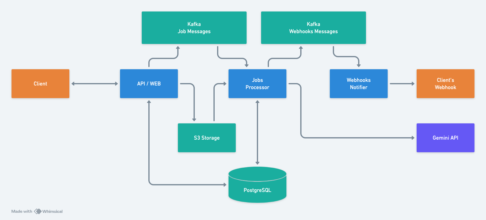

# The Great Stories

An API-first service that enriches text into segmented content with per-segment images and audio narration.

---

## Google Gemini 3 integration

This project is built for the [Gemini 3 Hackathon](https://gemini3.devpost.com) and **uses multiple Gemini 3 models** across the pipeline:

| Use case | Model | Role |
|----------|--------|------|
| **Text segmentation** | `gemini-3.0-flash` (primary), `gemini-2.5-flash-lite` (fallback) | Splits content into logical segments with titles and bounds |
| **Image generation** | `gemini-3-pro-image-preview` | Native image output via `ResponseModality: ["IMAGE"]` |
| **Narration scripts** | `gemini-3-pro-preview` | Style-adapted narration for TTS (educational / financial / fictional) |
| **Text-to-speech** | `gemini-2.5-pro-preview-tts` | Audio output with configurable voice (e.g. Zephyr, Puck, Aoede) |
| **Multi-modal input** | Gemini Pro vision | Extract/summarize text from uploaded images and PDFs |

The **Jobs Processor** (worker) calls these models to segment input, generate per-segment narration, produce TTS audio, create image prompts, and generate images. See [doc/GEMINI_INTEGRATION.md](./doc/GEMINI_INTEGRATION.md) for details.

---

## Architecture



See [doc/architecture.md](./doc/architecture.md) for detailed system design, [doc/requirements.md](./doc/requirements.md) for functional requirements, [doc/setup-and-development.md](./doc/setup-and-development.md) for setup, and [doc/webhooks.md](./doc/webhooks.md) for webhook delivery.

**API reference:** [openapi.yaml](./openapi.yaml) (OpenAPI 3.0)

## Quick Start

### Prerequisites

- Docker & Docker Compose
- Go 1.24+ (for local development without Docker)

### Local Development with Docker

1. Copy environment file:
   ```bash
   cp env.example .env
   ```

2. Add your Gemini API key to `.env`:
   ```bash
   GEMINI_API_KEY=your-actual-api-key
   ```

3. Start all services:
   ```bash
   docker-compose up -d
   ```

4. Run migrations:
   ```bash
   docker-compose exec api ./stories-api migrate
   ```

5. Access services:
   - API: http://localhost:8080
   - MinIO Console: http://localhost:9001 (minioadmin/minioadmin)
   - Redpanda Console: http://localhost:19644

### Create API Key

```bash
docker-compose exec postgres psql -U stories -d stories -c "
INSERT INTO users (id, email) VALUES (gen_random_uuid(), 'test@example.com') RETURNING id;
INSERT INTO api_keys (id, user_id, key_hash, status, quota_period, quota_chars) 
VALUES (gen_random_uuid(), '<user_id_from_above>', crypt('test-key-123', gen_salt('bf')), 'active', 'monthly', 100000);
"
```

### Test the API

```bash
curl -X POST http://localhost:8080/v1/jobs \
  -H "Authorization: Bearer test-key-123" \
  -H "Content-Type: application/json" \
  -d '{
    "text": "The solar system consists of the Sun and everything that orbits it...",
    "type": "educational",
    "pictures_count": 3,
    "audio_type": "free_speech",
    "webhook": {
      "url": "https://your-webhook-endpoint.com/callback"
    }
  }'
```

## Project Structure

```
stories/
├── cmd/
│   ├── api/          # API server main
│   ├── worker/       # Worker service main
│   └── dispatcher/   # Webhook dispatcher main
├── internal/
│   ├── auth/         # Authentication & API key validation
│   ├── quota/        # Quota management
│   ├── jobs/         # Job management
│   ├── segments/     # Segment processing
│   ├── assets/       # Asset storage & retrieval
│   ├── kafka/        # Kafka producer/consumer
│   ├── storage/      # S3 storage interface
│   ├── llm/          # LLM client (Gemini)
│   └── markup/       # Output markup generation
├── migrations/       # Database migrations
├── compose.yaml      # Docker Compose for local dev
├── Dockerfile        # Multi-stage Docker build
└── README.md
```

## Development

### Without Docker

1. Install dependencies:
   ```bash
   go mod download
   ```

2. Setup local Postgres, Kafka, and MinIO (update .env accordingly)

3. Run migrations:
   ```bash
   go run ./cmd/api migrate
   ```

4. Start services:
   ```bash
   # Terminal 1: API
   go run ./cmd/api

   # Terminal 2: Worker
   go run ./cmd/worker

   # Terminal 3: Dispatcher
   go run ./cmd/dispatcher
   ```

### Testing

```bash
go test ./...
```

### Building

```bash
# Build all binaries
make build

# Build specific binary
go build -o bin/api ./cmd/api
go build -o bin/worker ./cmd/worker
go build -o bin/dispatcher ./cmd/dispatcher
```

## Deployment

### Docker Compose

Deploy the full stack (API, worker, dispatcher, PostgreSQL, Kafka, MinIO) with Docker Compose:

1. Copy the environment file and set required variables:
   ```bash
   cp env.example .env
   # Edit .env: set DATABASE_URL, GEMINI_API_KEY, and any other production values
   ```

2. Build and start all services:
   ```bash
   docker-compose up -d --build
   ```

3. Run database migrations:
   ```bash
   docker-compose exec api ./stories-api migrate
   ```

4. The API is available on port 8080. Use the same [Create API Key](#create-api-key) and [Test the API](#test-the-api) steps as in Quick Start, adjusting the host if not localhost.

To stop:
```bash
docker-compose down
```

## API Documentation

Full specification: **[openapi.yaml](./openapi.yaml)** (OpenAPI 3.0). Use it with Swagger UI, Redoc, or any OpenAPI tool.

### Endpoints

#### POST /v1/jobs
Create a new enrichment job.

**Request:**
```json
{
  "text": "string (required, max 50k chars)",
  "type": "educational|financial|fictional (required)",
  "pictures_count": "integer (required, 1-20)",
  "audio_type": "free_speech|podcast (required)",
  "webhook": {
    "url": "string (optional)",
    "secret": "string (optional)"
  }
}
```

**Response (202 Accepted):**
```json
{
  "job_id": "uuid",
  "status": "queued",
  "created_at": "timestamp"
}
```

#### GET /v1/jobs/{job_id}
Get job status and results.

#### GET /v1/jobs
List user's jobs (with pagination).

#### GET /v1/assets/{asset_id}
Get asset metadata and download URL.

## License

Proprietary - Gemini 3 Hackathon Project
