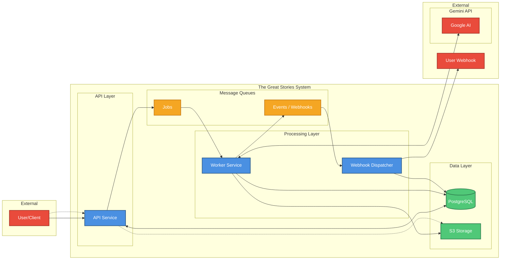

# The Great Stories — System Architecture Diagram

This diagram shows the main components and data flow. See [architecture.md](./architecture.md) for detailed design.

**Rich view:** Open [architecture-diagram.html](./architecture-diagram.html) in a browser for an HTML block diagram (User left, Gemini and webhooks right).

## Flow Summary

| Phase | Steps | Description |
|-------|-------|-------------|
| **Job creation** | 1–5 | User submits text → API validates & checks quota → Creates job & segments in DB → Publishes to Kafka → Returns job ID |
| **Processing** | 6–12 | Worker consumes job → Calls Gemini for segmentation, narration, images, audio → Stores assets in S3 and metadata in Postgres → Publishes completion event |
| **Webhook** | 13–16 | Dispatcher consumes event → Fetches job details → POSTs to user webhook with retries → Records delivery status |
| **Polling** | Dotted | User can poll job status and download assets via signed URLs |
